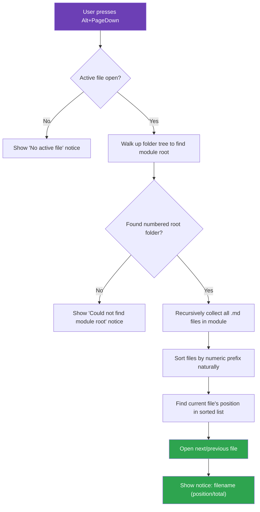

# Module Navigator — Obsidian Plugin

**Stop clicking through the file explorer.** Navigate through every file in your module tree sequentially with just a keyboard shortcut.

Built for structured note-taking workflows where files are organized in nested numbered folders and you want to read them **in order** — like flipping pages in a book.

---

## The Problem

Obsidian's default navigation only lets you move between **tabs** or search for files by name. If your notes are structured like this:

```
📁 3. My Course Module
├── 📁 3. My Course Module
│   └── 3.0. Introduction.md          ← You are here
├── 📁 3.1. Getting Started
│   └── 3.1. Getting Started.md
├── 📁 3.2. Core Concepts
│   └── 3.2. Core Concepts.md
├── 📁 3.3. Deep Dive
│   ├── 3.3.1. Part One.md
│   └── 3.3.2. Part Two.md
├── 📁 3.4. Advanced Topics
│   ├── 3.4.1. Topic A.md
│   ├── 3.4.2. Topic B.md
│   └── 3.4.3. Topic C.md
├── 📁 3.5. Practical Exercises
│   ├── 3.5.1. Exercise One.md
│   ├── 3.5.2. Exercise Two.md
│   └── 3.5.3. Exercise Three.md
└── 📁 3.6. Summary
    └── 3.6. Summary.md
```

Getting from `3.0. Introduction` to `3.1. Getting Started` means opening the file explorer, collapsing one folder, expanding another, and clicking the file. **Every. Single. Time.**

## The Solution

Press `Alt + PageDown` and you're on the next file. Press `Alt + PageUp` to go back. That's it.

The plugin flattens your entire module tree into a sorted reading order and lets you flip through it:


> It wraps around — after the last file, you loop back to the first.

---

## How It Works



**Key details:**

- **Module root detection** — The plugin walks up the folder tree from your current file and finds the highest ancestor folder that starts with a number (e.g., `3. My Course Module`). This is your module boundary.
- **Natural numeric sorting** — Files are sorted the way you'd expect: `3.1` → `3.2` → `3.3.1` → `3.3.2` → `3.4`, not the broken lexicographic order (`3.1` → `3.10` → `3.2`).
- **Cross-folder navigation** — Jumps seamlessly between folders. Going next from `3.3.2. Part Two` takes you straight to `3.4.1. Topic A`, even though they're in different folders.
- **Position indicator** — A notice pops up showing where you are: `3.3.2. Part Two (6/14)`.

---

## Hotkeys

| Action | Default Shortcut |
|---|---|
| Next file in module | `Alt + PageDown` |
| Previous file in module | `Alt + PageUp` |

You can rebind these in **Settings → Hotkeys** → search for "Module Navigator".

---

## Installation

### Option 1: One-Line Install (Recommended)

Open a terminal and paste the command for your OS. It clones the plugin directly into your vault.

> **Replace `PATH_TO_YOUR_VAULT`** with the actual path to your Obsidian vault.

**Windows (PowerShell)**
```powershell
git clone https://github.com/Kareem251199/module-navigator.git "$env:USERPROFILE\PATH_TO_YOUR_VAULT\.obsidian\plugins\module-navigator"
```

**macOS / Linux**
```bash
git clone https://github.com/Kareem251199/module-navigator.git ~/PATH_TO_YOUR_VAULT/.obsidian/plugins/module-navigator
```

Then open Obsidian → **Settings → Community Plugins** → Enable **Module Navigator**.

---

### Option 2: Manual Download

1. Go to the [latest release](../../releases/latest) page
2. Download **`main.js`** and **`manifest.json`**
3. In your vault, create the folder:
   ```
   .obsidian/plugins/module-navigator/
   ```
4. Copy `main.js` and `manifest.json` into that folder
5. Restart Obsidian
6. Go to **Settings → Community Plugins** → Enable **Module Navigator**

---

### Option 3: Clone & Stay Updated

Clone the repo so you can pull future updates with `git pull`:

```bash
cd /path/to/your/vault/.obsidian/plugins
git clone https://github.com/Kareem251199/module-navigator.git
```

To update later:
```bash
cd /path/to/your/vault/.obsidian/plugins/module-navigator
git pull
```

---

## Compatibility

- Works on **desktop** (Windows, macOS, Linux)
- Works on **mobile** (iOS, Android) — bind the commands via the mobile toolbar
- Requires Obsidian **v0.15.0+**

---

## Author

**Kareem Ahmed**

---

## License

[MIT](LICENSE)
